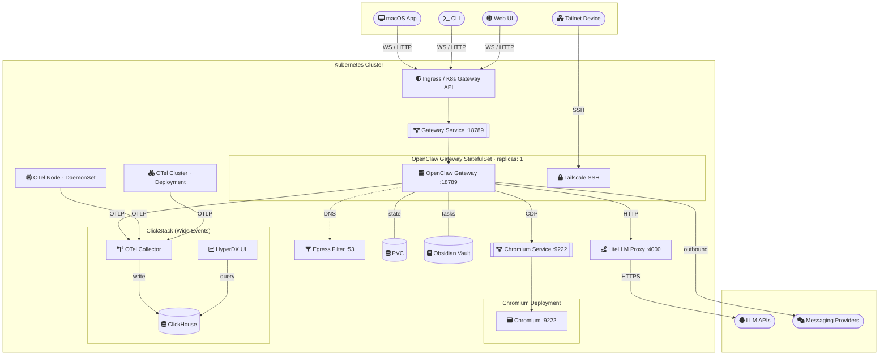

<div align="center">
<pre>
██╗  ██╗██╗   ██╗██████╗ ███████╗ ██████╗██╗      █████╗ ██╗    ██╗
██║ ██╔╝██║   ██║██╔══██╗██╔════╝██╔════╝██║     ██╔══██╗██║    ██║
█████╔╝ ██║   ██║██████╔╝█████╗  ██║     ██║     ███████║██║ █╗ ██║
██╔═██╗ ██║   ██║██╔══██╗██╔══╝  ██║     ██║     ██╔══██║██║███╗██║
██║  ██╗╚██████╔╝██████╔╝███████╗╚██████╗███████╗██║  ██║╚███╔███╔╝
╚═╝  ╚═╝ ╚═════╝ ╚═════╝ ╚══════╝ ╚═════╝╚══════╝╚═╝  ╚═╝ ╚══╝╚══╝
</pre>
</div>

<p align="center">
Production-grade <a href="https://openclaw.ai">OpenClaw</a> on Kubernetes.
</p>

<p align="center">
<a href="https://github.com/iMerica/kubeclaw/actions/workflows/lint-test.yaml"></a>
<a href="https://github.com/iMerica/kubeclaw/releases"></a>
<a href="https://github.com/iMerica/kubeclaw/blob/master/charts/kubeclaw/Chart.yaml"></a>
<a href="https://github.com/iMerica/kubeclaw/blob/master/charts/kubeclaw/Chart.yaml"></a>
<a href="https://github.com/iMerica/kubeclaw/blob/master/LICENSE"></a>
<a href="https://github.com/iMerica/kubeclaw/releases"></a>
<a href="https://github.com/iMerica/kubeclaw/pkgs/container/kubeclaw"></a>
<a href="https://github.com/iMerica/kubeclaw/actions/workflows/lint-test.yaml"></a>
<a href="https://github.com/iMerica/kubeclaw/actions/workflows/lint-test.yaml"></a>
<a href="https://github.com/iMerica/kubeclaw/actions/workflows/lint-test.yaml"></a>
</p>

---

## Prerequisites

- Any Kubernetes Cluster running 1.25+
- **Helm 3.12+** 


## Why KubeClaw

KubeClaw wraps OpenClaw with the operational guardrails that production deployments need: secure defaults, pinned images, predictable upgrades, egress filtering, and batteries-included observability so production feels deterministic. It uses the cluster as the control plane to make behavior visible and controllable by default. Wide Events unify observability, digest pinning prevents drift, and Blocky-backed DNS egress controls enforce a default-deny outbound posture with explicit allow/deny lists and query logging. The result is fewer trust gaps: what ran, what changed, what it called, and what it emitted are all auditable.


## Architecture



## Install

### One-line installer (recommended)

```sh
curl -fsSL https://kubeclaw.ai/install.sh | bash
```

### Via OCI (manual)

```sh
helm install kubeclaw oci://ghcr.io/imerica/kubeclaw \
  --version 0.1.0 \
  --namespace kubeclaw \
  --create-namespace \
  --set secret.data.OPENCLAW_GATEWAY_TOKEN=change-me

```

## Configuration

All values are documented inline in [`charts/kubeclaw/values.yaml`](charts/kubeclaw/values.yaml). The minimum required values are:

| Key | Notes |
|-----|-------|
| `secret.data.OPENCLAW_GATEWAY_TOKEN` | **Required.** Strong random string; treat as a password |
| `tailscale.ssh.authKey` | **Required** (unless `authKeySecretName` is set) |
| `litellm.masterkey` | **Required** when `litellm.enabled` (default). Must start with `sk-` |

Full configuration reference, advanced examples, and per-feature setup: **[Install Guide](docs/oss/README.md)** &middot; [kubeclaw.ai/docs](https://kubeclaw.ai/docs)

Image pinning policy: each chart release is validated against a candidate image, then the chart defaults are updated to the exact `image.tag` + `image.digest` before publishing.


## What You Get

| Feature | Description |
|---------|-------------|
| **StatefulSet** | Durable PVC-backed storage at `/home/node/.openclaw` |
| **GitOps-friendly config** | Declare desired `openclaw.json`; chart handles merge or overwrite via initContainer |
| **WebSocket-ready Ingress** | Configurable TLS |
| **K8s Gateway API routing** | Single-hostname path-based routing for all services via `gateway.networking.k8s.io/v1` HTTPRoutes; optional bundled Envoy Gateway controller |
| **Split workspace volume** | Separate PVC for workspace via `persistence.splitVolumes` |
| **Chromium Deployment** | Browser automation via standalone Deployment + ClusterIP Service on port 9222 (cluster-internal) |
| **LiteLLM proxy subchart** | Per-agent virtual keys, budget caps, model fallback routing, and semantic caching |
| **Wide Events observability** | Logs, metrics, traces, and Kubernetes events unified in [ClickHouse](https://clickhouse.com/) via the [Wide Events](https://charity.wtf/2019/02/05/logs-vs-structured-events/) pattern, replacing separate logging, metrics, and tracing backends. Ships with [HyperDX](https://hyperdx.io/) for search and dashboards, and [OpenTelemetry](https://opentelemetry.io/) collectors for zero-config cluster-wide collection |
| **Egress DNS filter** | NextDNS-style DNS filtering via [Blocky](https://0xerr0r.github.io/blocky/), including threat blocklists (HaGeZi, StevenBlack), country TLD blocking, and query logging |
| **NetworkPolicy** | Scaffolding for locking down traffic |
| **Diagnostics CronJob** | Periodic `openclaw doctor` runs |
| **Skills system** | Declarative skill install at deploy time; supports playbooks, clawhub, and npm registries |
| **Obsidian vault** | PVC-backed markdown vault mounted at `/vaults/obsidian`; wired to the Obsidian skill for task management |
| **Tailscale integration** | Expose the Gateway onto your tailnet without public ingress (`tailscale.expose`), and/or SSH into the pod from any enrolled device (`tailscale.ssh`) |


## Docs

| | |
|---|---|
| [Install Guide](docs/oss/README.md) | Step-by-step setup |
| [Verify](docs/oss/README.md#verify) | Lint, render, and schema checks |
| [Troubleshooting](docs/oss/README.md#troubleshooting) | Common issues and fixes |
| [Restore Runbook](docs/runbooks/restore.md) | Backup & recovery procedures |
| [Full Documentation](https://kubeclaw.ai/docs) | Complete reference at kubeclaw.ai |

## Community

| | |
|---|---|
| [Vision](VISION.md) | Project direction and priorities |
| [Contributing](CONTRIBUTING.md) | How to propose and ship changes |
| [Security Policy](SECURITY.md) | Private vulnerability reporting process |
| [Code of Conduct](CODE_OF_CONDUCT.md) | Community expectations |
| [Support](SUPPORT.md) | Where to ask for help |

## KubeClaw Enterprise

Need multi-tenancy, enterprise egress controls, SSO, policy-as-code, CSI-backed secrets, backup hooks, or signed OCI distribution? See [kubeclaw.ai](https://kubeclaw.ai).

## License

[Apache 2.0](LICENSE)
